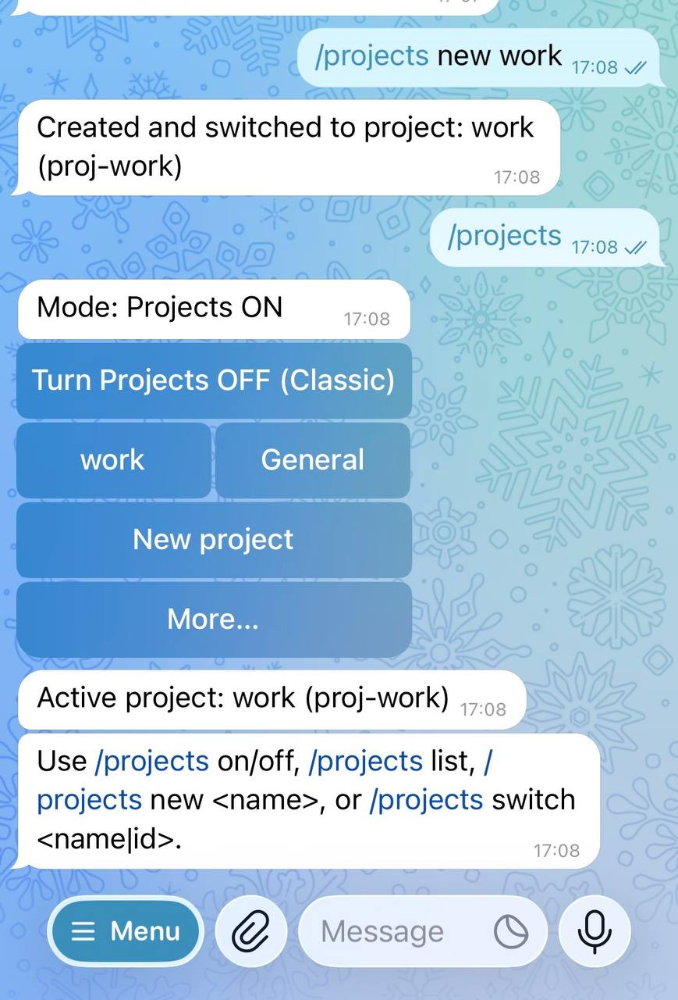

# openclaw-telegram-projects-ux

Telegram-first, plugin-scoped **Projects UX** for OpenClaw.

This repository is intentionally **out-of-tree** (not part of `openclaw/openclaw`).

## Quick start (Telegram)

```bash
git clone https://github.com/peteclt92/openclaw-telegram-projects-ux.git
cp -r openclaw-telegram-projects-ux/extensions/projects-ux ~/.openclaw/extensions/
openclaw gateway restart
```

In Telegram:

```
/projects on
/projects new work
/projects switch work
```

That’s it.

## Verify isolation in 30 seconds

```
/projects new test-a
/memory remember SENTINEL_A=neon

/projects new test-b
/memory list
```

If the second `/memory list` is empty, the plugin is working.

## Removing projects / recovery

In Telegram: `/projects` → **More…** → **Reset…**

Options:

- **Remove (wipe) ONE project**
- **Wipe ALL projects** (recovery)

All destructive actions are guarded and backed up.

## What this is

OpenClaw’s Telegram DMs don’t have reliable native threading or durable conversation boundaries.
This plugin provides an **opt-in** Projects UX that lets you segment a single Telegram DM into user-defined “projects”, and switch between them explicitly.

A **project** is a plugin-scoped unit of context that provides:
- project-scoped context/memory as implemented by the plugin (**not a security boundary**)
- explicit switching between contexts via `/projects`
- ability to turn Projects ON/OFF per DM
- a default project intended to approximate the user’s classic single-thread chat flow

This is implemented entirely at the plugin layer and is opt-in. If you never enable it, nothing changes.

## Preview (Telegram)

Projects UX in action inside a Telegram DM — project-scoped context with explicit switching and opt-in isolation.

<p align="left">
  
</p>

## Safety / constraints

- Two-step confirmation with a single-use nonce and short expiry (~120s)
- Automatic backup before any mutation of plugin-owned state
- Destructive actions are per-peer and limited to plugin-owned state under:
  - `~/.openclaw/projects-ux/`
- Default project is protected and cannot be removed
- No transcript/history deletion
- No modifications to repos under `~/projects/`

## Installation

See [INSTALL.md](./INSTALL.md) for complete setup steps (alternatives, config, uninstall).

## Compatibility (validated on)

Validated on:

- OpenClaw **v2026.1.30**

This repo is **Telegram-first** and depends on:

- OpenClaw plugin discovery + `openclaw.plugin.json` manifest loading
- Telegram command UI + inline button callback payload handling (the plugin uses `callback_data` values like `/projects ...`)
- Plugin state under `~/.openclaw/projects-ux/`
- Plugin hook entrypoints used by the extension:
  - `before_agent_start` (for project framing / one-shot anti-bleed)
  - `resolve_room_key` (optional; only if the plugin config enables Phase 2 hard isolation)

After OpenClaw upgrades, re-check:

- that Telegram inline button payloads still route to commands as expected
- that the `resolve_room_key` hook contract/name still matches (if you enable it)
- that plugin discovery precedence hasn’t changed for your chosen install method

## Contents

- `extensions/projects-ux/` — the plugin, copied as-is.

## Status

See `UPSTREAM_STATUS.md` for upstream context and links.
